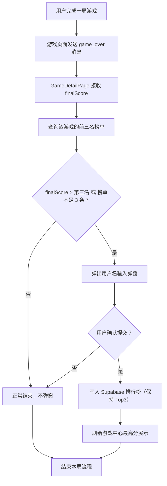
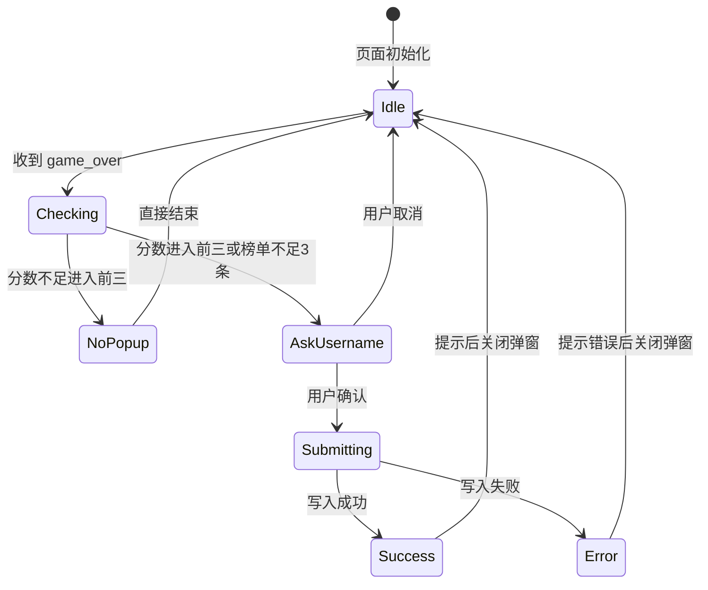

# 游戏中心排行榜与历史最高分需求文档（Supabase）

> **日期：** 2026-06-24
> **状态：** 待实施
> **关联页面：** `/games`、`/games/:gameSlug`
> **关联资源：**
> - [`/Users/lychee/Workspace/new-blog/src/features/games/views/GamesPage.vue`](/Users/lychee/Workspace/new-blog/src/features/games/views/GamesPage.vue)
> - [`/Users/lychee/Workspace/new-blog/src/features/games/views/GameDetailPage.vue`](/Users/lychee/Workspace/new-blog/src/features/games/views/GameDetailPage.vue)
> - [`/Users/lychee/Workspace/new-blog/src/utils/supabase.ts`](/Users/lychee/Workspace/new-blog/src/utils/supabase.ts)
> - [`/Users/lychee/Workspace/new-blog/public/games/2048/script.js`](/Users/lychee/Workspace/new-blog/public/games/2048/script.js)
> - [`/Users/lychee/Workspace/new-blog/public/games/tetris/index.html`](/Users/lychee/Workspace/new-blog/public/games/tetris/index.html)

---

## 一、背景与目标

当前博客中存在“游戏中心”，已有两个游戏：

- `2048`
- `俄罗斯方块（tetris）`

当前状态：
- `GamesPage.vue` 仅展示游戏卡片入口，不展示任何分数数据。
- `GameDetailPage.vue` 以 `iframe` 形式嵌入对应静态游戏页面。
- `2048` 有本地分数与本地排行榜逻辑（`public/games/2048/src/leaderboard.js`），但仅存浏览器本地。
- `tetris` 目前只在界面显示当前得分与结束分数，无排行榜能力。
- 博客已有 Supabase 客户端（`src/utils/supabase.ts`），可复用同一数据库。

### 本次目标

为游戏中心增加以下能力：
1. 将每款游戏的“前三名成绩”持久化到 Supabase（与博客同一数据库）。
2. 在每局游戏结束时，判断本局分数是否进入该游戏的前三名：
   - 若进入：弹窗让用户输入用户名，并把新成绩写入数据库，替换对应名次。
   - 若未进入：正常结束，不弹窗。
3. 在游戏中心（`/games`）的每张游戏卡片上新增“历史最高分”字段，显示数据库中的第一名分数。

---

## 二、需求范围

### 本次范围（MVP）

- 新增一张排行榜数据库表，用于存储每个游戏的前三名记录。
- 为 `2048` 与 `tetris` 接入“游戏结束 -> 上报成绩 -> 可能弹窗 -> 写入榜单”的流程。
- 游戏中心卡片展示该游戏当前最高分（来自数据库第一名）。
- 复用现有博客 Supabase 项目，不新建独立数据库。

### 本次不做

- 不做完整排行榜页面（例如 Top 10、历史明细、分页列表）。
- 不做账号体系绑定（本次仅保存匿名用户名）。
- 不强制要求管理员后台维护排行榜数据。
- 不重写现有游戏主逻辑，只做最小接入。

---

## 三、现有代码结构与接入点

## 3.1 前端页面层

### `GamesPage.vue`

当前是纯静态游戏列表，没有请求数据库。

本次改造点：
- 读取每个游戏对应的数据库最高分（第一名）。
- 在卡片中增加“历史最高分：xxx”的展示区。
- 当数据未加载或为空时，使用兜底文案（如“暂无记录”）。

### `GameDetailPage.vue`

当前是根据路由参数渲染 `iframe`，不感知游戏内部状态。

本次改造点：
- 负责统一“接收游戏结束事件”。
- 负责统一展示“是否进入前三名”的弹窗。
- 负责向 Supabase 查询/写入排行榜数据。

这样做的好处是：
- 两个静态游戏的改造成本最低；
- 排行榜逻辑集中维护；
- 不把 Vue 状态管理逻辑硬塞进现有纯 HTML/JS 游戏里。

---

## 3.2 现有游戏结束事件

### 2048

现有关键点在 [`public/games/2048/script.js`](/Users/lychee/Workspace/new-blog/public/games/2048/script.js)：

- 游戏结束逻辑在 `isGameOver()` 判定后执行 `showGameOver()`。
- `showGameOver()` 会：
  - 设置 `state.gameOver = true`
  - 写入 `final-score` 节点内容
  - 移除 `#game-over-modal` 的 `hidden`

因此 2048 适合在：
- `state.gameOver = true`
- `score` 已经确定
- modal 节点显示之前/之时

通过 `window.parent.postMessage(...)` 通知外层页面。

### 俄罗斯方块（tetris）

现有关键点在 [`public/games/tetris/index.html`](/Users/lychee/Workspace/new-blog/public/games/tetris/index.html)：

- 游戏结束逻辑在 `endGame()`。
- `endGame()` 会：
  - 设置 `gameOver = true`
  - 停止 `running`
  - 更新 `final-score` 节点
  - 添加 `#gameover-overlay` 的 `show`

因此 tetris 适合在 `endGame()` 内部新增一次 `postMessage`。

---

## 四、功能需求（Functional Requirements）

## 4.1 数据存储规则

### 存储粒度

- 按游戏维度存储。
- 每个游戏最多保留 3 条记录：
  - rank = 1（第一名）
  - rank = 2（第二名）
  - rank = 3（第三名）

### 字段要求

每条记录至少包含：
- `game_slug`：游戏标识
- `rank`：名次（1~3）
- `username`：用户填写的名字
- `score`：分数（整数）
- `created_at`：成绩产生时间
- 可选：`updated_at`，便于后续排序和审计

### 写入规则

- 当某局游戏结束分数 `current_score` 大于数据库中当前第三名分数（或榜单不足 3 条）时，允许写入。
- 若写入成功，需要保持：
  - 第一名是最高分
  - 第二名是第二高分
  - 第三名是第三高分
- 若新分数与已有分数相同：
  - MVP 阶段可采用“同分替换”或“同分不替换”。
  - 建议默认：**同分不替换**，只有严格大于第三名才触发弹窗与写入。

---

## 4.2 游戏结束流程

## 流程图



## 详细步骤

### Step 1：游戏结束上报

当游戏结束时，`iframe` 内游戏向父页面发送消息，结构建议：

```json
{
  "type": "game_over",
  "gameSlug": "2048",
  "score": 12340
}
```

说明：
- `gameSlug` 需与数据库一致（如 `2048`、`tetris`）。
- `score` 必须为整数。

### Step 2：父页面接收并查询榜单

`GameDetailPage.vue` 监听 `window.addEventListener("message", ...)`。

收到消息后：
1. 校验事件来源为当前 `iframe`。
2. 校验 `type === "game_over"`。
3. 读取当前游戏 `gameSlug` 与本次 `score`。
4. 从 Supabase 查询该游戏当前前三名记录。

### Step 3：判断是否进入前三

判定条件（满足其一即可触发弹窗）：
- 当前榜单记录不足 3 条；
- `current_score > rank_3_score`。

不触发条件：
- 当前分数小于等于第三名；
- 当前分数非法（非数字、负数、异常值）。

### Step 4：弹窗收集用户名

弹窗需要包含：
- 当前本局分数展示（只读）
- 输入框：用户名（必填）
- 提交按钮
- 取消按钮

输入约束建议：
- 不能为空
- 最大长度建议 12~16 个字符
- 去除首尾空格
- 不强制唯一（MVP 可重复）

### Step 5：写入排行榜

提交后调用 Supabase 写入接口，保持榜单仅存前三名。

### Step 6：UI 反馈

写入成功后：
- 弹窗提示“已上榜”
- 关闭弹窗
- 若当前在 `/games` 列表页可达，可顺带刷新最高分缓存

---

## 4.3 游戏中心卡片历史最高分

### 展示位置

在 [`GamesPage.vue`](/Users/lychee/Workspace/new-blog/src/features/games/views/GamesPage.vue) 的每个游戏卡片中新增一行：

- 文案格式建议：
  - `历史最高分：12340`
  - 若暂无记录：
    - `历史最高分：暂无`

### 数据来源

- 读取 `leaderboard` 表中该游戏 `rank=1` 的记录。
- 若无记录，不报错，显示兜底文案。

### 刷新时机

- 首次进入 `/games` 时加载。
- 当 GameDetailPage 写入新记录后，可通过事件总线或再次访问时刷新。
- MVP 阶段允许：再次进入游戏中心页面时刷新，不要求实时同步。

---

## 五、数据设计（Database）

## 5.1 表结构建议

建议新建表 `game_leaderboard`：

| 字段 | 类型 | 说明 |
|---|---|---|
| `id` | `uuid` | 主键 |
| `game_slug` | `text` | 游戏标识，例如 `2048` / `tetris` |
| `rank` | `smallint` | 名次，取值范围 1~3 |
| `username` | `text` | 用户名 |
| `score` | `integer` | 本局分数 |
| `created_at` | `timestamptz` | 入榜时间 |
| `updated_at` | `timestamptz` | 最近更新时间（可选） |

## 5.2 约束建议

- 主键：`id`
- 唯一约束：`(game_slug, rank)`
- 检查约束：`rank in (1,2,3)`
- 检查约束：`score >= 0`

示例 DDL：

```sql
create table public.game_leaderboard (
  id uuid primary key default gen_random_uuid(),
  game_slug text not null,
  rank smallint not null check (rank in (1, 2, 3)),
  username text not null,
  score integer not null check (score >= 0),
  created_at timestamptz not null default now(),
  updated_at timestamptz not null default now(),
  unique (game_slug, rank)
);
```

## 5.3 初始数据（可选）

若希望一开始就有完整结构，可为两款游戏预置空榜单：

```sql
insert into public.game_leaderboard (game_slug, rank, username, score)
values
  ('2048', 1, '—', 0),
  ('2048', 2, '—', 0),
  ('2048', 3, '—', 0),
  ('tetris', 1, '—', 0),
  ('tetris', 2, '—', 0),
  ('tetris', 3, '—', 0);
```

---

## 六、接口设计（Supabase）

## 6.1 读取某游戏前三名

建议读取接口：

```ts
const { data, error } = await supabase
  .from("game_leaderboard")
  .select("game_slug, rank, username, score, created_at, updated_at")
  .eq("game_slug", gameSlug)
  .order("rank", { ascending: true })
```

返回结构示例：

```json
[
  { "game_slug": "2048", "rank": 1, "username": "lychee", "score": 51200 },
  { "game_slug": "2048", "rank": 2, "username": "A", "score": 32000 },
  { "game_slug": "2048", "rank": 3, "username": "B", "score": 12000 }
]
```

---

## 6.2 写入新成绩（保持 Top3）

由于写入后需要保持前三名顺序，MVP 阶段建议使用 Supabase RPC（Postgres 函数）做原子更新。

### 推荐 RPC 名称

- `submit_game_score`

### 输入参数

- `p_game_slug text`
- `p_score integer`
- `p_username text`

### RPC 需要完成的事

1. 查询该游戏当前 3 条记录。
2. 判断 `p_score` 是否高于第三名。
3. 若高于：
   - 将三条记录合并为候选列表；
   - 排序保留前三；
   - 删除被挤出的记录；
   - 更新/插入新的 1~3 名记录。
4. 返回最终榜单。

### 为什么建议用 RPC

- 防止前端并发写入导致名次错乱。
- 后续可加服务端校验（例如分数合法性、用户名长度）。
- 接口语义更清晰。

---

## 6.3 前端调用示例

```ts
const { data, error } = await supabase.rpc("submit_game_score", {
  p_game_slug: "2048",
  p_score: 20480,
  p_username: "lychee"
})
```

返回建议是 3 条最终榜单记录，便于前端直接刷新本地展示。

---

## 七、前端改造设计

## 7.1 新增模块建议

建议在 `src/features/games/` 下新增：

- `composables/useGameLeaderboard.ts`
  - 封装榜单读取
  - 封装提交成绩
  - 封装最高分缓存
- `components/GameScoreSubmitModal.vue`
  - 弹窗 UI
  - 用户名输入
  - 提交中状态
  - 提交成功/失败提示

---

## 7.2 GameDetailPage 改造设计

[`GameDetailPage.vue`](/Users/lychee/Workspace/new-blog/src/features/games/views/GameDetailPage.vue) 将作为“排行榜协调者”。

职责：
- 渲染 iframe
- 监听 `message` 事件
- 打开提交弹窗
- 调用提交接口
- 通知外部榜单更新

---

## 7.3 GamesPage 改造设计

[`GamesPage.vue`](/Users/lychee/Workspace/new-blog/src/features/games/views/GamesPage.vue) 将新增：

- 在 `games` 数组中补充 `gameSlug`（已有 `slug` 可复用）
- 启动时批量读取所有游戏的 `rank=1` 记录
- 每张卡片绑定对应最高分

---

## 7.4 两个静态游戏最小改造

## 2048

在 [`public/games/2048/script.js`](/Users/lychee/Workspace/new-blog/public/games/2048/script.js) 的 `showGameOver()` 内新增：

```js
window.parent?.postMessage?.({
  type: "game_over",
  gameSlug: "2048",
  score: state.score
}, "*")
```

改造点说明：
- 在 `state.gameOver = true` 之后
- 在 modal 已经显示前或显示时均可
- 保持原有本地逻辑不破坏

---

## 俄罗斯方块（tetris）

在 [`public/games/tetris/index.html`](/Users/lychee/Workspace/new-blog/public/games/tetris/index.html) 的 `endGame()` 内新增：

```js
window.parent?.postMessage?.({
  type: "game_over",
  gameSlug: "tetris",
  score
}, "*")
```

改造点说明：
- 放在 `gameOver = true` 之后
- 放在 overlay 显示前后均可

---

## 八、状态机与边界条件

## 8.1 排行榜判定状态机



---

## 8.2 边界条件

### 必须处理

- 榜单为空（首次使用）：应触发弹窗。
- 榜单只有 1~2 条：只要当前分数高于已有记录中的最低名次分数，就触发。
- 网络失败：提示错误，不阻塞用户继续游玩。
- 弹窗未提交时用户刷新页面：不写入数据库。
- 非法分数（NaN、负数）：忽略该次上报。

### 建议处理

- 用户名过长：前端截断并提示。
- 多次快速触发 game_over：前端做节流，短时间内只处理第一次。
- iframe 消息来源校验：必须校验 `event.source` 或 URL，防止外部注入。

---

## 九、用户体验与交互规范

## 9.1 弹窗体验

弹窗中建议包含：
- 标题：`新纪录`
- 副标题：`恭喜进入前三，请输入用户名`
- 当前分数展示
- 输入框
- 按钮：`提交`
- 按钮：`取消`

## 9.2 卡片体验

游戏中心卡片新增字段：
- 标签：`历史最高分`
- 数值：第一名分数
- 空态：`暂无记录`

---

## 十、权限与安全

## 10.1 推荐策略

### 阶段一（MVP）

- 前端直接读写 `game_leaderboard`。
- 开启 RLS，仅允许：
  - 公开 `select`
  - 公开 `insert`（通过 RPC 或受控接口）
- 不开放 `update` / `delete` 给匿名用户。

### 阶段二（增强）

- 只允许通过 `submit_game_score` 函数写入。
- 后端增加：
  - 分数范围校验
  - 游戏 slug 白名单
  - 用户名单条长度限制
  - 频率限制（IP / session / cookie）

---

## 10.2 推荐 RLS 示例

```sql
alter table public.game_leaderboard enable row level security;

create policy "public read game leaderboard"
on public.game_leaderboard
for select
using (true);
```

写入建议通过 RPC 控制，不直接对匿名用户开放 wide-open insert/update/delete。

---

## 十一、实施计划

## 11.1 Phase 1：数据库层

1. 新建 `game_leaderboard` 表。
2. 新增 `(game_slug, rank)` 唯一约束。
3. 创建 `submit_game_score` RPC。
4. 在 Supabase 控制台测试手动写入与查询。

## 11.2 Phase 2：前端能力层

1. 新增 `useGameLeaderboard.ts`。
2. 实现读取某游戏前三名。
3. 实现提交成绩 RPC 调用。
4. 实现 `GameScoreSubmitModal.vue`。

## 11.3 Phase 3：页面接入层

1. 改造 `GameDetailPage.vue`：
   - 监听 `message`
   - 调用查询与提交逻辑
   - 弹窗联动
2. 改造 `GamesPage.vue`：
   - 加载各游戏最高分
   - 渲染到卡片中
3. 改造 `2048`：
   - 在 `showGameOver()` 增加 `postMessage`
4. 改造 `tetris`：
   - 在 `endGame()` 增加 `postMessage`

## 11.4 Phase 4：验证与打磨

1. 验证首次空榜单流程。
2. 验证进入前三流程。
3. 验证未进入前三流程。
4. 验证网络失败与重试。
5. 验证刷新后榜单仍存在。
6. 验证游戏中心最高分正确展示。

---

## 十二、验证标准（Acceptance Criteria）

1. `2048` 游戏结束后，若分数进入前三，父页面弹出用户名输入框。
2. `tetris` 游戏结束后，若分数进入前三，父页面弹出用户名输入框。
3. 提交成功后，数据库仅保留该游戏的前三名记录。
4. 若分数未超过第三名，游戏结束时不再弹窗。
5. `/games` 游戏中心卡片正确显示每款游戏的历史最高分。
6. 若某游戏无记录，卡片显示“暂无记录”。
7. 多次写入后，第一名始终为该游戏当前最高分。
8. 网络异常时提示错误，不影响继续游玩。

---

## 十三、测试用例设计

## 13.1 功能测试

### 2048

- 本局分数 0：不弹窗
- 本局分数小于第三名：不弹窗
- 本局分数等于第三名：不弹窗（若采用“同分不替换”）
- 本局分数大于第三名：弹窗，提交后榜单更新
- 榜单为空：弹窗，提交后成为第一名

### tetris

- 本局分数 0：不弹窗
- 本局分数小于第三名：不弹窗
- 本局分数等于第三名：不弹窗（若采用“同分不替换”）
- 本局分数大于第三名：弹窗，提交后榜单更新

---

## 13.2 边界测试

- 同时有两个浏览器标签结束游戏（并发写入）
- 弱网环境下提交
- 输入框只输入空格
- 输入框超长字符串
- 用户拒绝提交（点击取消）
- iframe 加载延迟时发送消息

---

## 十四、开发约束与代码风格

- 复用现有 Supabase 客户端，不另建连接方式。
- 排行榜逻辑集中到 `src/features/games/`，不散落在各静态游戏深处。
- 静态游戏只承担“通知 game_over”，不承担数据库写入。
- UI 需与当前博客设计系统变量保持一致（`var(--bg-surface)`、`var(--border)` 等）。
- 不引入新的重依赖（优先使用 Supabase JS + Vue 组件）。
- 数据库字段使用 `snake_case`，前端可映射为 `camelCase`。

---

## 十五、推荐字段映射（前端）

```ts
interface GameLeaderboardRow {
  gameSlug: string
  rank: number
  username: string
  score: number
  createdAt: string
  updatedAt: string
}
```

查询后可映射为：

```ts
const rows = data.map(row => ({
  gameSlug: row.game_slug,
  rank: row.rank,
  username: row.username,
  score: row.score,
  createdAt: row.created_at,
  updatedAt: row.updated_at
}))
```

---

## 十六、后续扩展建议（非本次必须）

- 增加“查看排行榜”弹窗或独立页面
- 增加用户标识（登录后写入 uid）
- 增加排行榜刷新动画与新纪录动效
- 增加“本周最佳 / 本月最佳”筛选
- 增加反作弊校验（关键逻辑迁移到 Edge Function）

---

## 十七、总结

本次需求的核心是“复用博客现有 Supabase，新增一个最小可用的游戏前三名排行榜系统”。

实现顺序建议：
1. 数据库与 RPC
2. 排行榜读写 Composable
3. 弹窗组件
4. GameDetailPage 接入
5. 静态游戏 `postMessage`
6. GamesPage 展示最高分

这样可以在不重构现有游戏主逻辑的前提下，完成“游戏结束弹窗上榜 + 游戏中心展示历史最高分”的目标。
